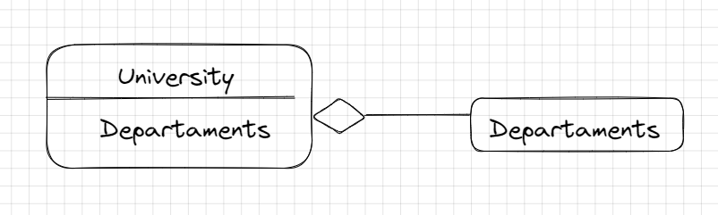
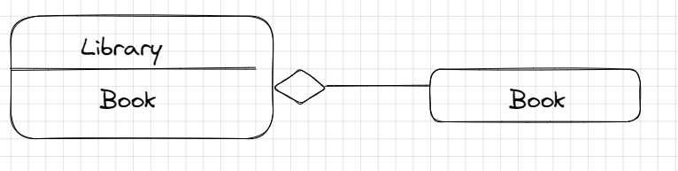
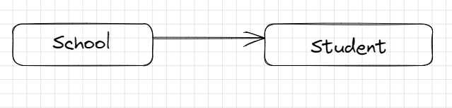

[Assignment](https://github.com/rumq/java-springboot-course/blob/main/pages/CommonClassNotes.md#20-apr-22-thursday)

### [Dependency Injection Demystified](https://www.jamesshore.com/v2/blog/2006/dependency-injection-demystified)

After reading this article the things I understood are :
- Is a 25 dollar term for a 5 cent concept, so it's a important concept but it's not as difficult as it seems to be.
- DI means giving an object its instance variables, set the values to the variable.
  
### [Composition, Aggregation, and Association](https://www.baeldung.com/java-composition-aggregation-association) 
After reading this article the things I understood are :
- Objects have relationships between them:
    - Composition
    - Aggregation
    - Association
- Composition -> One of the objects is a logically larger structure, which contains the other object. It is `belongs-to` or `has-a` relationship. The objects lifecycles are tied. It means that if the owner object it's destroyed , its members also will be destroyed . 

- Aggregation ->  One object is composed of one or more other objects, but the composed objects can exist independently.The lifecycles of the objects aren't tied, every one of them can exist independently of each other.It is `has-a` relationship.
  
- Association -> is a type of relationship where two objects are associated with each other, but neither object is a part of the other. In other words, both objects can exist independently of each other, means that the objects “know” each other
  

## What's the difference between a Framework and a Library?
A library is a collection of pre-written code that can be used by other software programs to perform specific tasks. A library usually contains a set of functions or methods that can be called from within a program.

A framework is a complete system that provides a set of rules, guidelines, and tools for developing software applications. A framework typically provides a set of reusable code modules, as well as guidelines for how to structure and organize code.

The difference between a library and a framework is that a library is a collection of pre-written code that is used by a program, while a framework is a complete system that provides a structure and set of rules for developing software applications.

## What's a Bean?
A bean in Spring Boot is a object that is annotated with the `@Component` annotation or one of its derived annotations, such as `@Service` or `@Controller`.

## What's a Component?
A component is a Java class that is annotated with the `@Component` annotation 

## What's Singleton?
A singleton is a design pattern that ensures that only one instance of a particular class is created and used throughout the lifetime of the application.

## What's Singleton Scope and Prototype Scope?
A Prototype bean is created every time it is requested by the application context or injected into another bean. This means that a new instance of the bean is created each time it is requested meanwhile with singleton scopeonly one instance of a class is created in every call.