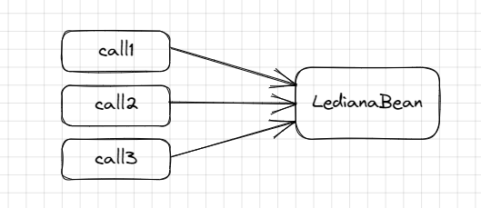
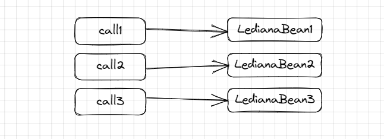

## Beans And Dependency Injection
---
### Content:
- Components and Beans
- Dependency Injection
---

**Components and Beans**

#### Components in SpringBoot are classes defined by a annotation. The annotations can be:
- @Component ->detect beans automatically.
- @Service -> used to define business logic and operations that can be performed on the application data (DI).
- @Repository -> used to manage data access and persistence in an application.
- @Controller/@RestController -> used to handle HTTP requests in a web application.@Controller sends the respons in normal fromat, @RestController  sends the response in JSON or XML Format

#### When a SpringBoot application starts it will create automatically `beans` that are instance(objects) of the classes.
Objects in SpringBoot are serializable that means:
- The interface `java.io.Serializable` is implemented. 
- The object is represented in binary format.
- The needs of getters and setters.
  
Beans are stored in `Application Context` and they can be accesed like this:
```
ApplicationContext ctx = SpringApplication.run(Application.class, args);
		MyComponent bean = ctx.getBean(MyComponent.class);
		System.out.println(bean); 
        
```
When the bean is created it will take the name of the class with the first letter lowercase , but you can change the name like this :
```
@Component("LedianaBean")
```
So the name of the bean will be `LedianaBean`.

### Scope of the Beans
Scope of the beans means the lifetime of the object.
- Singleton -> One instance on that object will be created , because a class is a blueprint and you can create multiple objects ,but you want one object of this class so you can use the singleton scope `@Scope("singleton")` in the `@Component` class. For each call you get the same bean
  

- @Laizy ->By default, all beans in Spring Boot are eagerly initialized, which means that they are created when the application starts up. This can lead to longer startup times and increased memory usage, especially for applications with a large number of beans so the usage of this annotation will do the initialization of the bean when it will be needed.
- Prototype ->this annotation is used to indicate that a bean should be created in a new instance every time it is requested by another component in the application  `@Scope("prototype")`.
  

- Session -> are created once per user session and are destroyed when the session expires `@Scope("session")`.
- Request -> are created once per HTTP request and are destroyed at the end of the request `@Scope("request")`.
- Application -> are created once per web application and are destroyed when the application is shut down `@Scope("application")`.


**Dependency Injection**

  Dependency Injection is a design pattern that set the values to the variables and is implemented by using the `@Autowired` annotation that can be used to inject dependencies.
  ```
  @Service
public class MyService {
    
    @Autowired
    private MyRepository repository;  
}
```
The `MyService` class is annotated with `@Service`. The `@Autowired` annotation is used to inject a dependency of type `MyRepository` into the `MyService` bean. When Spring Boot creates an instance of `MyService`, it will automatically inject an instance of `MyRepository` into the `repository` field.

#### The `@Autowired` can be used on Maps , collection.
#### There are some ways to inject the values to the bean :
- use $ sign -> `@Value("${name}")`.
- use # -> `@Value("#{5+1-6}")` .
- in application.properties section in project.


*This information is based on this [ppt](https://github.com/rumq/spring-boot-in-3-weeks/blob/master/slides/pdfs/04_Beans_DependencyInjection.pptx.pdf).*